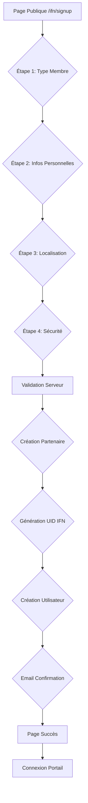

# Guide d'Enrôlement IFN Portal Common

## 🎯 Vue d'Ensemble

Le module **IFN Portal Common** inclut désormais un système complet d'enrôlement public qui permet aux nouveaux utilisateurs de s'inscrire directement depuis le portail web, sans nécessiter d'intervention manuelle des administrateurs.

## 📋 Processus d'Inscription

### 🔄 Flux d'Inscription

1. **Accès Public** : `/ifn/signup` - Page d'accueil d'inscription
2. **Formulaire Multi-étapes** : 4 étapes guidées avec validation
3. **Création Automatique** : Génération UID IFN et compte utilisateur
4. **Vérification** : Email et téléphone à valider
5. **Redirection** : Accès au portail selon le rôle

### 📝 Étapes du Formulaire

#### Étape 1: Type de Membre 👤
- **Marchand** : Vendeur/Commerçant (🛒)
- **Producteur** : Agriculteur/Artisan (🌱)
- **Gestionnaire Coopérative** : Administrateur coopérative (👥)

#### Étape 2: Informations Personnelles 📝
- Prénom et Nom obligatoires
- Email professionnel
- Téléphone (format +225 XX XX XX XX XX)
- Validation en temps réel

#### Étape 3: Localisation 🌍
- Sélection de la région (13 régions ivoiriennes)
- Village/Commune (optionnel)
- Géolocalisation automatique possible

#### Étape 4: Sécurité 🔐
- Mot de passe sécurisé (8+ caractères)
- Force du mot de passe (faible/moyen/fort)
- Confirmation du mot de passe
- Acceptation conditions d'utilisation

## 🔧 Implémentation Technique

### Routes Principales

```python
# Page d'inscription publique
@http.route('/ifn/signup', type='http', auth='public', website=True)
def ifn_signup(self, **kw):
    """Page d'inscription IFN"""
    return request.render('ifn_portal_common.ifn_signup', values)

# Soumission du formulaire
@http.route('/ifn/signup/submit', type='http', auth='public', methods=['POST'], website=True, csrf=True)
def ifn_signup_submit(self, **kw):
    """Création du compte IFN"""
    # Validation et création utilisateur/partenaire

# Vérification téléphone
@http.route('/ifn/verify/phone/<token>', type='http', auth='public')
def verify_phone(self, token, **kw):
    """Vérification par SMS"""

# Vérification email
@http.route('/ifn/verify/email/<token>', type='http', auth='public')
def verify_email(self, token, **kw):
    """Vérification par email"""
```

### Champs IFN Créés

#### `res.users` Extension
```python
ifn_uid = fields.Char('UID IFN')                    # Identifiant unique
ifn_phone_verified = fields.Boolean('Téléphone vérifié')
ifn_email_verified = fields.Boolean('Email vérifié')
ifn_kyc_level = fields.Selection('Niveau KYC')     # 0-3
ifn_language = fields.Selection('Langue IFN')      # FR/BA/DI
ifn_high_contrast = fields.Boolean('Contraste élevé')
ifn_font_size = fields.Selection('Taille police')
ifn_voice_enabled = fields.Boolean('Assistance vocale')
ifn_last_login = fields.Datetime('Dernière connexion')
ifn_login_count = fields.Integer('Nombre connexions')
```

#### `res.partner` Extension
```python
ifn_uid = fields.Char('UID IFN')
ifn_member_type = fields.Selection('Type membre IFN')
ifn_primary_phone = fields.Char('Téléphone principal')
ifn_secondary_phone = fields.Char('Téléphone secondaire')
ifn_whatsapp = fields.Char('WhatsApp')
ifn_region = fields.Char('Région IFN')
ifn_department = fields.Char('Département IFN')
ifn_village = fields.Char('Village/Commune IFN')
ifn_coordinates = fields.Char('Coordonnées GPS')
ifn_verified = fields.Boolean('Vérifié IFN')
ifn_verification_date = fields.Datetime('Date vérification')
```

## 🎨 Interface Utilisateur

### Caractéristiques du Formulaire
- **Responsive Design** : Mobile-first
- **Multi-langue** : Français/Baoulé/Dioula 🇫🇷🇨🇮
- **Accessibilité** : WCAG 2.1 AA
- **Animations** : Transitions fluides entre étapes
- **Validation Temps Réel** : Feedback immédiat

### Composants Clés
- **Indicateur d'Étapes** : Navigation visuelle
- **Cartes de Sélection** : Interface intuitive pour les types
- **Barre de Force Mot de Passe** : Indicateur visuel
- **Messages d'Erreur** : Contextuels et clairs

## 🔐 Sécurité et Validation

### Validation des Données
```javascript
// Email format validation
const emailRegex = /^[^\s@]+@[^\s@]+\.[^\s@]+$/;

// Phone format validation (Côte d'Ivoire)
const phoneRegex = /^(\+225|225|0)[0-9]{8,10}$/;

// Password strength validation
const passwordRegex = /^(?=.*[a-z])(?=.*[A-Z])(?=.*\d).{8,}$/;
```

### Mesures de Sécurité
- ✅ **Protection CSRF** sur tous les formulaires
- ✅ **Validation Serveur** des entrées utilisateur
- ✅ **Hachage Mot de Passe** via Odoo framework
- ✅ **Vérification Email** obligatoire
- ✅ **Vérification Téléphone** par token
- ✅ **Limitation Tentatives** (implémentable)

## 📊 Workflow d'Inscription



## 🌍 Support Multilingue

### Langues Disponibles
- **Français** : Langue principale
- **Baoulé** : Support local 🇨🇮
- **Dioula** : Support local 🇨🇮

### Messages Traduits
- Messages d'erreur et validation
- Labels des formulaires
- Notifications automatiques
- Pages de succès/erreur

## 📱 Accès Mobile

### PWA Integration
- Formulaire accessible via mobile
- Navigation optimisée tactile
- Mode hors ligne possible (partiel)
- Installation app mobile possible

### Responsive Breakpoints
- **Desktop** : 1200px+
- **Tablette** : 768px-1199px
- **Mobile** : <768px

## 🔧 Configuration

### Prérequis
```python
# Dependencies dans __manifest__.py
"depends": [
    "base",
    "portal",
    "website",
    "web",
    "ifn_core",  # Pour les groupes IFN
]
```

### Paramètres Optionnels
```python
# Activer l'inscription publique
ifn_signup_enabled = True

# Niveau KYC par défaut
ifn_default_kyc_level = '0'

# Activer la vérification SMS/Email
ifn_verification_required = True
```

## 📈 Monitoring et Rapports

### Métriques Disponibles
- **Taux de Conversion** : Visites → Inscriptions
- **Type de Membres** : Répartition par catégorie
- **Taux de Vérification** : Email/Téléphone
- **Erreurs d'Inscription** : Types et fréquences

### Logs Système
- Tentatives d'inscription réussies/échouées
- Créations de comptes utilisateurs
- Activités de vérification
- Erreurs de validation

## 🚀 Déploiement

### Étapes de Mise en Production
1. **Installer le module** : `ifn_portal_common`
2. **Vérifier les dépendances** : `ifn_core` obligatoire
3. **Configurer les routes** : Accès web publique
4. **Tester le flux** : Scénarios de test complets
5. **Monitoring** : Surveiller les erreurs

### Tests Recommandés
```bash
# Test de l'inscription
POST /ifn/signup/submit

# Test de validation email
GET /ifn/verify/email/{token}

# Test de validation téléphone
GET /ifn/verify/phone/{token}
```

## 🔄 Évolutions Futures

### Fonctionnalités Planifiées
- **Inscription SMS** : Formulaire mobile simplifié
- **Vérification Document** : Upload KYC documents
- **Workflow Approbation** : Validation admin requis
- **Intégration Mobile Money** : Paiement instantané
- **Analytics Avancées** : Tableaux de bord inscription

### Améliorations Possibles
- **Formulaire Progressif** : Sauvegarde automatique
- **Intelligence Artificielle** : Détection fraudes
- **API Externe** : Intégration systèmes tiers
- **Gamification** : Tutos interactifs

## 🆘 Support et Dépannage

### Erreurs Communes
- **Email existe déjà** : Redirection vers page connexion
- **Format téléphone invalide** : Message format spécifique
- **Mot de passe faible** : Feedback visuel immédiat
- **Conditions non acceptées** : Blocage soumission

### Logs Utiles
```bash
# Logs d'inscription
grep "IFN inscription" /var/log/odoo/odoo.log

# Erreurs de validation
grep "ifn_signup_error" /var/log/odoo/odoo.log

# Créations utilisateurs
grep "ifn_uid" /var/log/odoo/odoo.log
```

---

## 📞 Support Technique

Pour toute question ou problème technique avec le système d'enrôlement IFN :

- **Email** : support@ifn.org
- **Documentation** : https://docs.ifn.org
- **Issues** : https://github.com/ifn/ifn-portal/issues
- **Community** : https://community.ifn.org

---

**Le système d'enrôlement IFN Portal Common offre une expérience d'inscription moderne, sécurisée et accessible, conçue spécifiquement pour les besoins de l'écosystème financier inclusif ivoirien.**